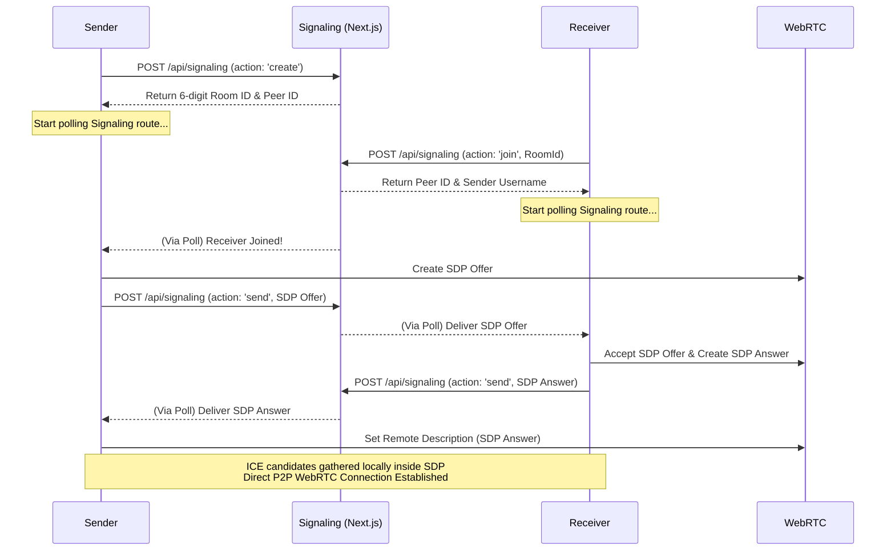
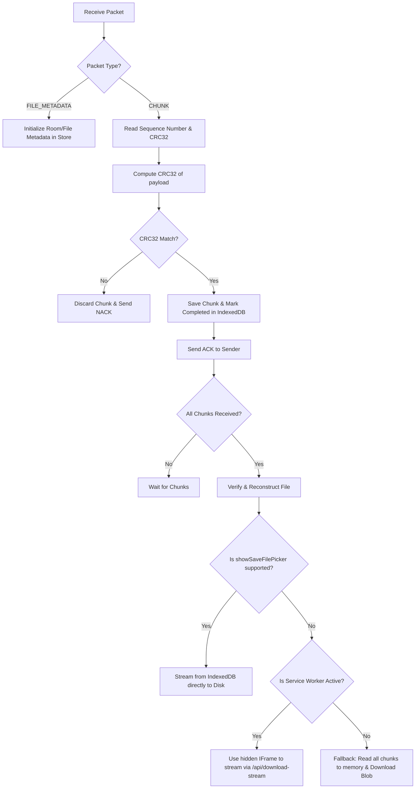

# DirectShare Send & Receive Logic Documentation

This document provides a comprehensive, step-by-step breakdown of how connection establishment, file sharing, chunk transmission, and local storage/downloads function in the DirectShare project.

---

## 1. File Inventory
The send and receive architecture is distributed across the following key files:

*   **Signaling & Connection:**
    *   [`src/services/SignallingService.ts`](file:///c:/Users/RUCHIT/OneDrive/Desktop/projects/dshare/src/services/SignallingService.ts): Client-side signaling engine utilizing HTTP polling to `/api/signaling`.
    *   [`src/app/api/signaling/route.ts`](file:///c:/Users/RUCHIT/OneDrive/Desktop/projects/dshare/src/app/api/signaling/route.ts): Built-in in-memory Next.js server route that manages room creation, client joining, and SDP/ICE candidate message relays.
    *   [`src/services/WebRTCService.ts`](file:///c:/Users/RUCHIT/OneDrive/Desktop/projects/dshare/src/services/WebRTCService.ts): Wrapper around the browser's `RTCPeerConnection` API. Sets up connections, creates/accepts SDP offers/answers, monitors ICE state, and manages the binary data channel.
*   **Transfer Logic:**
    *   [`src/services/SenderService.ts`](file:///c:/Users/RUCHIT/OneDrive/Desktop/projects/dshare/src/services/SenderService.ts): Orchestrates the sender workflow, managing the chunk sliding window, congestion control, timeouts, retransmissions (ACK/NACK/SNACK), and backpressure.
    *   [`src/services/ReceiverService.ts`](file:///c:/Users/RUCHIT/OneDrive/Desktop/projects/dshare/src/services/ReceiverService.ts): Orchestrates the receiver workflow, managing chunk integrity (CRC32), marking completed chunks in IndexedDB, sending feedback (ACK/NACK), and handling file reconstruction and download.
    *   [`public/transferWorker.js`](file:///c:/Users/RUCHIT/OneDrive/Desktop/projects/dshare/public/transferWorker.js): A dedicated background Web Worker that performs CPU-intensive file slicing, reads data into `ArrayBuffer`s synchronously using `FileReaderSync`, and computes CRC32 checksums without blocking the main thread.
*   **Utilities & Protocol Helpers:**
    *   [`src/lib/chunker.ts`](file:///c:/Users/RUCHIT/OneDrive/Desktop/projects/dshare/src/lib/chunker.ts): Provides helper functions to dynamically scale the chunk size (from 128KB to 1MB) based on network Round Trip Time (RTT).
    *   [`src/lib/serializer.ts`](file:///c:/Users/RUCHIT/OneDrive/Desktop/projects/dshare/src/lib/serializer.ts): Formats packets into binary buffers using `DataView` for efficient transfer over the data channel.
    *   [`src/lib/crc32.ts`](file:///c:/Users/RUCHIT/OneDrive/Desktop/projects/dshare/src/lib/crc32.ts): Standard cyclic redundancy check implementation used for checking packet corruption.
    *   [`src/utils/db.ts`](file:///c:/Users/RUCHIT/OneDrive/Desktop/projects/dshare/src/utils/db.ts): Manages IndexedDB connection (`directshare_db`), storing temporary file chunks under the `"chunks"` store, transfer metadata under `"transfers"`, and transfer logs under `"history"`.
    *   [`public/sw.js`](file:///c:/Users/RUCHIT/OneDrive/Desktop/projects/dshare/public/sw.js): Intercepts fetch requests to `/api/download-stream` to read chunked data from IndexedDB on-the-fly and output it as a download stream.

---

## 2. Step-by-Step Connection Process

DirectShare establishes peer-to-peer (P2P) connections through a combination of an HTTP signaling relay and WebRTC.



### Detailed Breakdown:
1.  **Room Creation (Sender):**
    *   The sender generates a 6-digit Room ID and local host Peer ID by sending a `POST` request to `/api/signaling` with `action: 'create'`.
    *   The signaling server stores this room info in memory.
    *   The sender starts polling the signaling route every 1200ms using `startPolling()`.
2.  **Room Joining (Receiver):**
    *   The receiver joins by sending a `POST` request with `action: 'join'`, referencing the 6-digit Room ID.
    *   Upon joining, the server flags the room as populated and queues a notification.
3.  **SDP Exchange:**
    *   During polling, the sender discovers the receiver joined.
    *   The sender calls `webrtc.createOffer()`, sets its local description, waits for ICE gathering (direct connection route discovery), and publishes the offer to the signaling route.
    *   The receiver polls the signaling route, retrieves the SDP offer, accepts it via `webrtc.acceptOffer()`, generates an SDP answer, sets its own local description, and uploads the answer.
    *   The sender polls and retrieves the SDP answer, completing the SDP negotiation.
4.  **WebRTC Peer Connection & DataChannel Setup:**
    *   Once descriptions are set, the browsers negotiate a direct P2P link.
    *   The data channel (`directshare-channel`) is configured as **unordered** (`{ ordered: false }`). This is a key design choice: we handle packet sequence order, congestion control, and loss recovery at the application level to maximize performance over unstable networks.
5.  **ICE Connection Monitoring & Auto-Recovery:**
    *   If the connection state changes to `disconnected` or `failed`, both peers pause sending and initiate auto-recovery.
    *   The peers resume signaling polling. If the connection remains broken after 5 seconds, the sender triggers an **ICE Restart** by generating a new SDP offer (`iceRestart: true`) and exchanging it through the signaling channel. If connection is not re-established within 30 seconds, it times out and aborts.

---

## 3. Step-by-Step Send Process (Sender Side)

Once the DataChannel is open, the sender streams files in a reliable chunk-by-chunk pipeline.

```mermaid
graph TD
    A[Start Session] --> B[Send File List JSON]
    B --> C{Receiver Accept?}
    C -- No --> D[Error / Terminate]
    C -- Yes --> E[Compute Metadata & Send FILE_METADATA Packet]
    E --> F[Initialize Web Worker]
    F --> G{Next Chunk Index < Total Chunks?}
    G -- Yes --> H[Request Chunk from Web Worker]
    H --> I[Read slice as ArrayBuffer in Worker]
    I --> J[Compute CRC32 Checksum in Worker]
    J --> K[Post Chunk to Sender queue]
    K --> L[Is DataChannel buffer full (>2MB)?]
    L -- Yes --> M[Wait for onbufferedamountlow]
    L -- No --> N[Serialize & Send CHUNK Packet]
    N --> O[Mark In-Flight & Start RTO Timer]
    O --> G
    G -- No --> P[Send FILE_COMPLETE_VERIFY Packet]
```

### Detailed Breakdown:
1.  **File Selection & Initialization:**
    *   The sender initializes files and updates `useTransferStore`.
    *   The sender sends a `file-list` control JSON to the receiver. Once accepted, the sender proceeds.
2.  **Streaming Initiation:**
    *   The sender begins the loop with `streamNextFile()`.
    *   It determines the safe chunk size based on RTT (e.g. 1MB for RTT < 50ms, 256KB for RTT > 300ms).
    *   It sends a binary `FILE_METADATA` packet containing file configuration details (ID, name, size, type, total chunks, chunk size).
3.  **Background Slicing & Checksumming (Web Worker):**
    *   The sender spawns `transferWorker.js`.
    *   The sender requests chunks as needed based on its sliding window.
    *   The worker reads only the requested slice using `FileReaderSync.readAsArrayBuffer(file.slice(start, end))` and calculates the CRC32 checksum.
    *   The worker posts the chunk back and transfers ownership of the `ArrayBuffer` directly to avoid memory copies.
4.  **Congestion Control & Sliding Window:**
    *   A sliding window (`windowSize`, starting at 16 chunks) limits the number of packets allowed in-flight simultaneously (`inFlight.size + pendingPackets.length`).
    *   As ACKs return, the window slides forward. The window size scales up using an additive-increase algorithm (`windowSize = windowSize + 1/windowSize`).
    *   If a timeout occurs (the chunk is in-flight for longer than the computed RTO), the window is cut in half (`windowSize = max(4, windowSize / 2)`) to mitigate network congestion.
5.  **Backpressure Management:**
    *   The WebRTC DataChannel has a limited buffer. Sending too fast without checking buffer capacity will result in dropped packets or crashed channels.
    *   Before sending any packet, `SenderService` checks the channel's `bufferedAmount`.
    *   If `bufferedAmount` exceeds a safety threshold of **2MB**, the sender pauses transmission and registers a callback via `onbufferedamountlow` (1MB threshold).
    *   Once the buffer drains below 1MB, the callback fires, and transmission resumes.
6.  **Retransmission Loops:**
    *   Every 150ms, a retransmission scheduler checks all in-flight chunks.
    *   If any chunk's age exceeds the dynamic RTO (calculated as `RTT * 2`, minimum 200ms), it is marked for retransmission and queued back in `pendingPackets`.
    *   If a specific chunk is retransmitted more than 10 times without success, the session is aborted.

---

## 4. Step-by-Step Receive Process (Receiver Side)

The receiver processes incoming packets, validates their integrity, records them to IndexedDB, and initiates the local download.



### Detailed Breakdown:
1.  **Packet Processing & Validation:**
    *   The receiver accepts binary packets from `onBinaryMessage`.
    *   `FILE_METADATA` packets initialize file status and prepare the store.
    *   `CHUNK` packets extract payload, index, and checksum.
    *   The receiver runs `crc32(payload)` and compares it against the packet's `chunkChecksum`. If they don't match (corruption detected), the receiver discards the chunk and returns a `NACK` packet, prompting the sender to retransmit immediately.
2.  **Local Storage (IndexedDB):**
    *   Valid chunks are stored in IndexedDB (`directshare_db` in the `"chunks"` store) using a key composed of `${fileId}_${sequenceNumber}`.
    *   The chunk index is recorded in the `"transfers"` store to support pause/resume state persistence.
    *   The receiver replies with an `ACK` packet containing the sequence number.
3.  **File Reconstruction & Saving (Triple-Fallback):**
    *   When the sender completes the stream, it requests verification via a `file-complete-verify` control packet.
    *   The receiver ensures all write transactions to IndexedDB have finished, deletes the temporary metadata in the `"transfers"` store, logs the file history, and triggers `reconstructAndDownload()`.
    *   The saving process uses three layers of fallback to maximize speed, save memory, and maintain high compatibility:

    #### Layer 1: File System Access API (Recommended)
    *   If `'showSaveFilePicker' in window` is true, the browser prompts the user to select a location on their computer/device.
    *   The receiver opens a writable file stream.
    *   It loops through the chunks in IndexedDB, reads them one-by-one, and writes them directly to disk.
    *   This is memory-efficient (no memory overhead) and avoids Service Worker issues.

    #### Layer 2: Hidden IFrame SW Streaming (Fallback for Large Files)
    *   If the browser does not support `showSaveFilePicker` but the file is large (>50MB), the receiver verifies if the Service Worker is actively controlling the client using a ping check (`fetch('/api/download-stream?ping=true')`).
    *   If the Service Worker responds, the receiver creates/modifies a hidden `<iframe>` and sets its `src` to the stream URL:
        `/api/download-stream?fileId=...&name=...&type=...&size=...&totalChunks=...`
    *   Routing this request through an `<iframe>` ensures the browser passes it to the Service Worker fetch handler (avoiding standard browser limitations where direct `<a>` link clicks bypass Service Workers).
    *   The Service Worker retrieves the chunks from IndexedDB sequentially, pushes them into a `ReadableStream`, and serves a streaming response with an attachment header.
    *   The browser download manager streams the incoming data straight to the Downloads directory.

    #### Layer 3: Memory Blob Reconstruction (Ultimate Fallback)
    *   If the file is small (<50MB) or if the other methods fail (e.g. private tabs, browsers without SW or FS APIs), the receiver falls back to in-memory construction.
    *   It loads all chunks from IndexedDB into a single in-memory array, creates a `Blob` object, creates a local object URL (`URL.createObjectURL(blob)`), and triggers a click on a temporary `<a>` element to save it.
    *   It then cleans up by deleting the database chunks and revoking the object URL.
